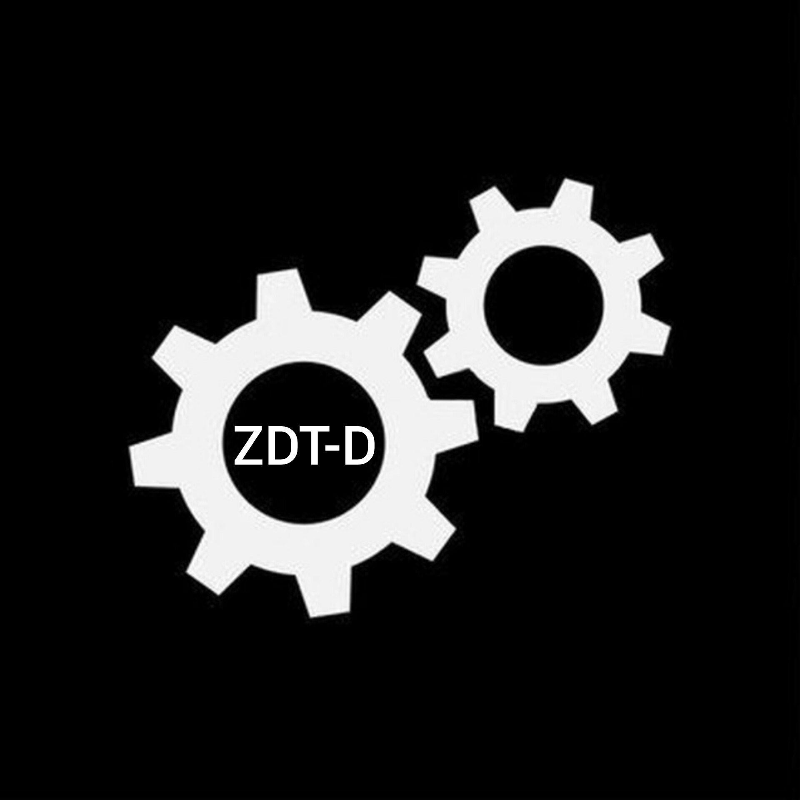

# ZDT-D Root Module

  

<h3 align="center">
  Android root network orchestration module for DPI bypass, proxy chaining, DNS control, and per-app routing
</h3>

  
  
  
  
  
  
  

  
  
  
  
  
  

  
  
  
  
  
  

  <b>ZDT-D</b> is an Android root module for traffic routing, DPI bypass, proxy chaining, DNS control, and per-app network management.

---

## Description

**ZDT-D** is a root-based Android network orchestration project for advanced traffic routing, DPI circumvention, DNS handling, local proxy pipelines, and selective VPN/TUN binding.

It is not a classic Android VPN application and it is not limited to one bundled engine. ZDT-D uses a local root daemon, Android application UIDs, `iptables` / `ip6tables`, NFQUEUE, local loopback services, and Android `netd` to route selected applications through different processing paths.

The project includes:

- a local Rust daemon (`zdtd`)
- an Android application for configuration and status control
- bundled networking tools for different routing and compatibility scenarios
- internal builders for UID-based redirection and Android `netd`-based TUN binding

> The Android app is available in Russian and English.

---

## What makes ZDT-D different

Most Android VPN or proxy applications use a single `VpnService` instance, create one virtual TUN interface, and route all or selected traffic through one global pipeline.

ZDT-D uses a different model:

- it works with root privileges
- it does not depend on Android `VpnService` as its main traffic engine
- it can route traffic by Android application UID
- it can apply `iptables` / `ip6tables` rules
- it can send traffic to NFQUEUE-based DPI engines
- it can redirect selected applications to local proxy services on `127.0.0.1`
- it can bind selected applications to existing or generated TUN interfaces through Android `netd`
- it can run several engines and profiles at the same time

Because of this, ZDT-D is closer to a root-based traffic management platform than to a traditional VPN client.

---

## Feature overview

| Area | Status | Description |
|---|---:|---|
| Root module |  | Works as a root-level Android module |
| Per-app routing |  | Routes selected Android applications by UID |
| DPI bypass |  | Supports DPI circumvention engines and traffic processing |
| NFQUEUE |  | Sends selected traffic to userspace packet processors |
| Local proxy redirection |  | Redirects selected traffic to local loopback services |
| Android `netd` binding |  | Binds selected app UIDs to TUN interfaces |
| DNS control |  | Supports local DNS handling and DNS-related routing |
| Conflict checks |  | Prevents incompatible app-list intersections |
| Custom programs |  | Allows user-provided binaries and scripts |

---

## Split tunneling and app-based control

ZDT-D does not blindly route the whole device through one tunnel.

The user selects Android applications, the daemon resolves package names into Linux UIDs, and those UIDs are used by the routing layer. Depending on the selected program, traffic can be sent through `iptables`, NFQUEUE, a local transparent proxy pipeline, or an Android `netd` VPN binding.

This makes it possible to build flexible scenarios such as:

- one application through OpenVPN + Android `netd`
- another application through tun2socks + Android `netd`
- another application through a local sing-box or wireproxy pipeline
- selected applications through NFQUEUE-based DPI circumvention
- selected applications through an Opera proxy pipeline
- selected applications through a custom TUN interface exposed by `myvpn`

ZDT-D is designed for selective routing. It does not force every application into the same path.

---

## Routing models

ZDT-D supports multiple independent traffic handling paths.

| Routing model | Description |
|---|---|
| NFQUEUE path | Selected application traffic can be matched by UID and sent into NFQUEUE. A userspace DPI engine can then inspect or modify packets. |
| Transparent local redirection | Selected application traffic can be redirected to a local listener on `127.0.0.1:<port>`. Local helper programs then forward or process the stream. |
| Android `netd` / TUN binding | When a supported program creates or exposes a TUN interface, ZDT-D can bind selected application UIDs to that interface through Android `netd`. |
| DNS handling | ZDT-D can manage local DNS components and route DNS-related traffic in controlled scenarios. |
| Custom program path | User-provided binaries or scripts can be launched and combined with ZDT-D routing features. |

---

## Supported components

| Component | Type | Purpose |
|---|---|---|
| `zdtd` | Rust daemon | Local root daemon, API, profile handling, rule application |
| Android app | Kotlin / Jetpack Compose | User interface, configuration, status control |
| `iptables` / `ip6tables` | System firewall | UID-based matching, NAT, redirection, packet filtering |
| NFQUEUE engines | DPI path | Userspace packet processing |
| `dnscrypt-proxy` | DNS | Local DNS resolver |
| `sing-box` | Proxy / TUN engine | Advanced proxy and routing scenarios |
| `wireproxy` | SOCKS5 bridge | WireGuard userspace SOCKS5 proxy |
| `tor` + `lyrebird` | Tor / bridges | Tor connectivity with pluggable transports |
| `opera-proxy` | Local proxy | Opera proxy pipeline |
| `byedpi` | DPI bypass | DPI circumvention helper |
| `tun2socks` | TUN to proxy | TUN interface to proxy pipeline |
| `openvpn` | VPN / TUN | OpenVPN profile support |
| `myprogram` | Custom launcher | User-defined binary/script launcher |
| `myvpn` | TUN binding | Bind selected apps to existing TUN interfaces |

---

## Flexible program architecture

ZDT-D is built around profile-based programs rather than a single fixed binary.

Different programs can have their own profiles, settings, app lists, logs, and runtime behavior. The daemon collects enabled profiles, validates conflicts, starts the required engines, and applies the correct routing model for each one.

The project supports several categories of components:

- DPI and NFQUEUE engines
- transparent proxy engines
- local proxy pipelines
- DNS components
- VPN/TUN + Android `netd` binding
- user-defined process launchers
- port protection and diagnostic helpers

This architecture makes the project flexible: new engines can be added without redesigning the entire routing system.

---

## Custom programs and extensibility

A major goal of ZDT-D is extensibility.

The project is not limited to pre-defined tools. Users can add their own network programs and combine them with ZDT-D routing features.

For example:

- `myprogram` can launch a user-provided binary or script
- that binary can create a local proxy, a service, or a TUN interface
- `myvpn` can bind selected applications to an already existing TUN interface
- the daemon can still handle UID parsing, conflict checks, and Android `netd` binding

This allows ZDT-D to be used as a base for custom Android networking setups, not only as a ready-made module with fixed behavior.

---

## Conflict control

Because several programs can target the same applications, ZDT-D checks app-list conflicts.

An application should not be assigned to multiple incompatible network pipelines at the same time. This reduces broken routing, duplicated redirection, and hard-to-debug conflicts between profiles.

Some helper features, such as QUIC blocking, can be used alongside other routing modes when they do not conflict with the main traffic path.

---

## Documentation

| Document | Purpose |
|---|---|
| [`README.md`](README.md) | Main project overview |
| [`docs/PROGRAMS.md`](docs/PROGRAMS.md) | Supported programs and internal components |
| `INSTRUCTIONS.md` | Practical usage notes, troubleshooting, and advanced examples |
| [`LICENSE`](LICENSE) | GPL-3.0 license |
| [Releases](https://github.com/GAME-OVER-op/ZDT-D/releases) | Stable builds and changelogs |
| [Issues](https://github.com/GAME-OVER-op/ZDT-D/issues) | Bug reports and feature requests |

---

## Privacy

ZDT-D does not collect, transmit, sell, share, or use personal data.

All configuration, routing, rule management, and runtime control required for the module to work are performed locally on the installed device.

The project does not require remote telemetry or analytics for core functionality.

If the application connects to external resources, it does so only for actions explicitly requested by the user, such as checking releases or downloading updates from official upstream sources.

---

## Safety and compatibility

ZDT-D works with low-level Android networking components. Compatibility may vary depending on:

- ROM behavior
- root implementation
- SELinux behavior
- kernel features
- `iptables` / `ip6tables` support
- Android `netd` behavior
- bundled binary compatibility

Some antivirus products may flag DPI-related tools because they work with low-level network traffic. This does not mean that ZDT-D collects data or performs remote telemetry.

ZDT-D is intended for advanced users, network compatibility research, routing control, and enthusiast use.

---

## Downloads

The latest builds are available on the GitHub Releases page:

- [Download latest release](https://github.com/GAME-OVER-op/ZDT-D/releases/latest)
- [View all releases](https://github.com/GAME-OVER-op/ZDT-D/releases)

---

## Project status

| Metric | Badge |
|---|---|
| Stars |  |
| Forks |  |
| Watchers |  |
| Total downloads |  |
| Latest release |  |
| Release date |  |
| Last commit |  |
| Open issues |  |
| Open pull requests |  |
| Repository size |  |
| Contributors |  |
| Top language |  |

  
  
  

  <b>Development is active.</b> 
  ZDT-D is continuously evolving as a root-based Android traffic management platform.

---

## License

GPL-3.0 License — see [LICENSE](LICENSE).
